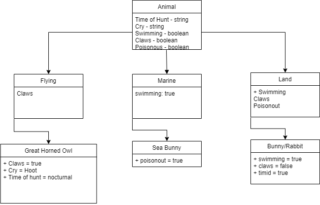

# OOP-Principles

## Problem Domain
A zoo contains animals, and animals can come in many different shapes and sizes. It is your job to plan and build out what animals live in the zoo.

## UML

## Progress of Commits:
1. Added sln and console files
2. Added class files for Animal, Flying, Land, Marine.
3. Added code for the Program.cs

## Specifications
Program Specifications
Your solution should include the following:

Have at least 3 different abstract classes
Have at least 3 layers of inheritance
Have at least 5 concrete animals
Have at least 2 abstract methods (make sure you override them)
Have at least 2 abstract Properties (make sure you override them)
Have at least 2 virtual methods (make sure you override at least one of them)
Have at least 2 virtual properties (make sure you override at least one of them)
Your (digital) drawing of your zoo diagram should be clearly labeled
NOTE: You are not required to be scientifically correct with your animal names. Keep the names of your animals simple. For example you do not need to label your animals anything more complicated than Mammal, Reptile, Cat, Bird, etc…